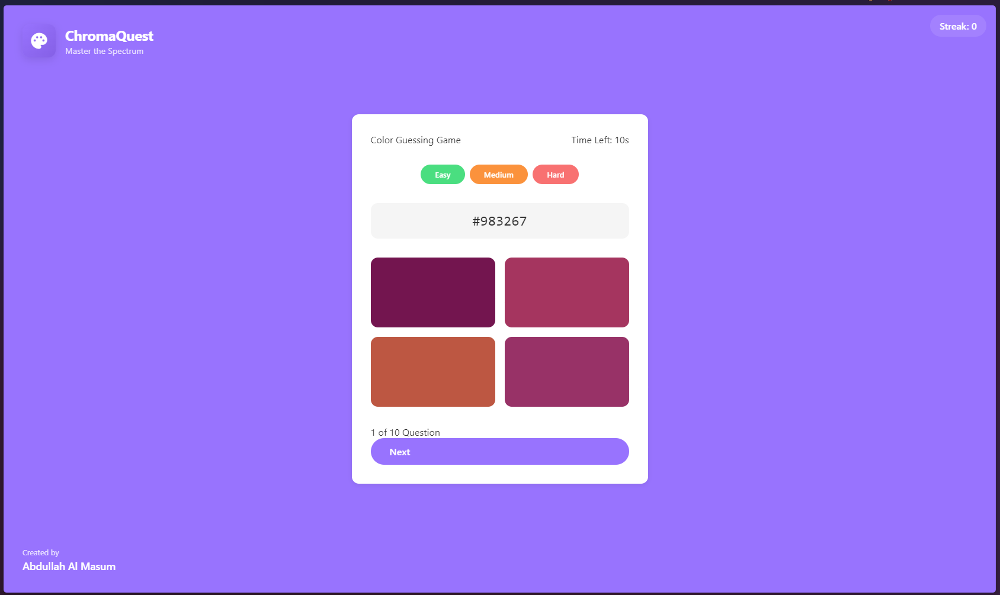

# ChromaQuest - Color Guessing Game 🎨

ChromaQuest is an engaging color guessing game that challenges players to identify the correct color based on its hexadecimal code. Test your color perception skills while racing against time!



## 🎮 Features

- **Multiple Difficulty Levels**
  - Easy: 15 seconds, larger color variations
  - Medium: 10 seconds, moderate variations
  - Hard: 7 seconds, subtle variations

- **Scoring System**
  - Base points for correct answers
  - Time bonus for quick responses
  - Streak bonus for consecutive correct answers

- **Interactive UI**
  - Clean, modern interface
  - Real-time feedback
  - Responsive design for all devices
  - High score tracking

## 🚀 How to Play

1. Choose your difficulty level (Easy, Medium, or Hard)
2. Match the displayed hex color code with the correct color option
3. Score points based on:
   - Speed of answer
   - Maintaining streaks
   - Difficulty level

## 🛠️ Technologies Used

- HTML5
- CSS3
- JavaScript (Vanilla)
- Google Material Icons
- Local Storage for high scores

## 🎯 Game Mechanics

- **Scoring System**
  ```javascript
  Easy Mode:
    Base Score: 10 points
    Time Bonus: 1 point per second remaining
    Streak Bonus: 2 points per streak level

  Medium Mode:
    Base Score: 15 points
    Time Bonus: 2 points per second remaining
    Streak Bonus: 3 points per streak level

  Hard Mode:
    Base Score: 20 points
    Time Bonus: 3 points per second remaining
    Streak Bonus: 4 points per streak level
  ```

## 🎨 Color Generation

The game generates colors using a sophisticated algorithm that:
1. Creates random base colors
2. Generates similar variations based on difficulty
3. Ensures visible differences between options

## 📱 Responsive Design

- Desktop optimized layout
- Tablet-friendly interface
- Mobile-responsive design
- Adaptive UI elements

## 🔄 Future Updates

- [ ] Sound effects
- [ ] Achievement system
- [ ] Global leaderboard
- [ ] Colorblind mode
- [ ] Tutorial mode
- [ ] Additional difficulty levels

## 🚀 Getting Started

1. Clone the repository
   ```bash
   git clone https://github.com/devAbdullahAlMasum/ChromaQuest.git
   ```

2. Open `index.html` in your browser

3. Start playing!

## 🤝 Contributing

Contributions are welcome! Feel free to:
1. Fork the repository
2. Create a feature branch
3. Submit a pull request

## 📝 License

This project is licensed under the MIT License - see the [LICENSE](LICENSE) file for details.

## 👨‍💻 Author

**Abdullah Al Masum**
- GitHub: [@devAbdullahAlMasum](https://github.com/devAbdullahAlMasum)

## 🙏 Acknowledgments

- Inspired by color theory and design principles
- Thanks to all contributors and testers

---
Made with ❤️ by Abdullah Al Masum
